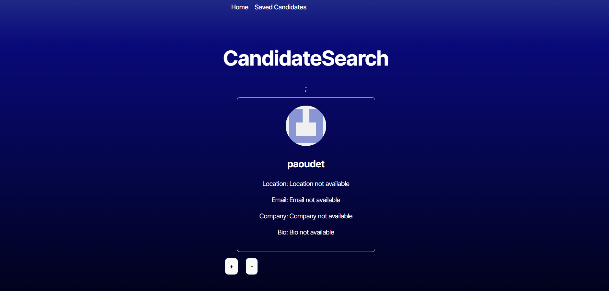
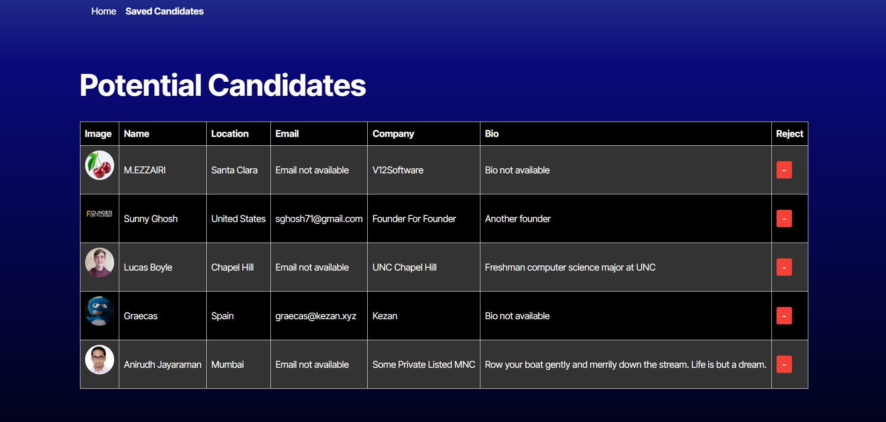

# Candidate Search

## Description:

This project show some profiles from github as a potencial candidates, The users would have the option to choose the candidate and save it or just eliminate and keep looking for more Candidates
Also, There is a list where the users can check all candidates they choose and remove it if they do not like it anymore

## Motivation:
Learn how React, Typescript, API and localhost can work together to create a more accessible and functional application for a user

## Build:
I decided to create this application to make it easier to search for candidates on Github and to practice React along with Tyspescript

## Learn:
I learned how to properly use React, TypeScript and API for the benefit of the user

## Table of Contents

- [Installation](#installation)
- [Usage](#usage)
- [License](#license)
- [Contributing](#contributing) 

## Installation

You will have to clone the repository,
Then, install all node packages
Add on the file .env your Github Key
Last step will be running the command line npm run dev
You are ready to go!

## Usage
You will find many ways to use this application, which will facilitate the process of searching for candidates on Github, it will show you the name, email, location, biography and company to which they belong.

Feel free to go into this video to get more information about usage:
https://www.loom.com/share/4cf64b7acfc942528aafdcfc2e05805b

## License:
MIT

[MIT License](https://opensource.org/licenses/MIT)

## Contributing:
- React
- Typescript
- Local Host
- GitHub API
- Made by: laura aristizabal
- GitHub: https://github.com/laristizabal02/CandidateSearch
- Email: lauris.paz@hotmail.es

